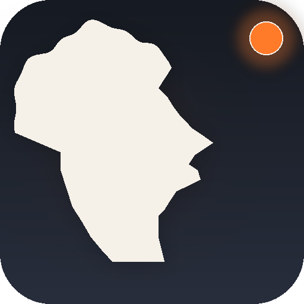

<h1 align="center">UNIFICATION</h1>

<p align="center">
  
</p>

<p align="center">
  <b>Vibe codez vos modeles 3D, images et plus encore</b><br/>
  Blender · FreeCAD · GIMP · Inkscape · Photoshop — 100&nbsp;% local, sans clé d'API, sans cloud.<br/>
  Prompt en langage naturel → Ollama → script Python → addon TCP MCP.
</p>

<p align="center">
  <a href="https://github.com/Oli97430/UNIFICATION/releases/latest">
    
  </a>
  
  
  
</p>

<p align="center">
  🇬🇧 <a href="README.md">English version</a>
</p>

---

## Sommaire

- [Ce que ça fait](#ce-que-ça-fait)
- [Fonctionnalités](#fonctionnalités)
- [Démarrage rapide](#démarrage-rapide)
- [Modèles recommandés](#modèles-recommandés)
- [Architecture](#architecture)
- [Raccourcis clavier](#raccourcis-clavier)
- [Réglages](#réglages)
- [Fichiers utilisateur](#fichiers-utilisateur)
- [Troubleshooting](#troubleshooting)
- [Build & release](#build--release)
- [Licence](#licence)

---

## Ce que ça fait

UNIFICATION est un client desktop moderne (construit avec `customtkinter`) qui fait le pont entre un LLM **local** Ollama et plusieurs applications créatives : **Blender · FreeCAD · GIMP · Inkscape · Photoshop**. Tu décris ce que tu veux en langage naturel ; l'app demande à Ollama d'écrire le script Python, puis l'exécute dans ton appli créative via un socket TCP — sans qu'un seul octet quitte ta machine.

| | |
|---|---|
| **Zéro cloud** | Chaque token reste local. Aucun quota, aucune facturation, aucune fuite de données. |
| **Installation addon en un clic** | L'app détecte toutes les installations Blender présentes sur ton système et copie l'addon à la bonne place. |
| **Auto-fix sur erreur** | Quand Blender lève une exception, la traceback est renvoyée au modèle pour une auto-correction silencieuse. |
| **Durci pour Blender 4.x** | System prompt renforcé + sanitizer AST qui réécrit les appels API cassés avant qu'ils atteignent Blender (renommages BSDF, types de lampes supprimés, signature `brushes.new()`, import/export OBJ, `mathutils.radians`, …). |
| **Support vision** | Attache une image de référence quand tu utilises un modèle vision (`qwen2.5-vl`, `llava`, …). |
| **Multilingue** | Interface complète EN / FR — détectée automatiquement depuis la locale de l'OS. |

---

## Fonctionnalités

### Setup & onboarding
- **Installateur d'addon intégré** — détecte automatiquement les dossiers Blender sur Windows, macOS, Linux (y compris Snap et Flatpak). Télécharge la dernière version depuis GitHub ; utilise le bundle hors-ligne en fallback.
- **Gestionnaire de modèles** — liste, change et `ollama pull` avec barre de progression et bouton d'annulation, directement depuis l'app.
- **Pastilles de statut live** pour Ollama et Blender (cliquables pour forcer un rafraîchissement).
- **Vérification de mise à jour silencieuse** au démarrage — notification toast si une version plus récente existe sur GitHub.

### Chat & génération de code
- **Streaming token par token** avec bouton Stop et raccourci `Esc`.
- **Code éditable** — retouche le script généré avant de l'envoyer à Blender.
- **Auto-run** — exécution immédiate après la fin du streaming.
- **Boucle auto-fix** — sur erreur Blender, re-soumet automatiquement avec la traceback (configurable, 1 tentative par défaut).
- **Lint AST** avant envoi — les erreurs de syntaxe sont attrapées sans aller-retour Blender.
- **Render preview** — après exécution, l'addon rend le viewport et l'app affiche le PNG en ligne.
- **Stats par turn** — nombre de tokens, durée, tokens/s.
- **Sauvegarde `.py`** par turn ; **export** de la conversation entière en JSON.
- **Régénération** (`↻`), **éditer & re-soumettre** (`✎`), **copier** (`📋`) et **supprimer** (`🗑`) par turn.
- **Turns repliables** — clique sur l'en-tête d'une réponse pour replier/déplier.
- **Historique persistant** entre sessions (`~/.unification/history.json`), avec trimming automatique par budget de tokens.
- **Indicateur de budget tokens** — affiche `utilisé / budget tok` en temps réel près du prompt.
- **Routing dynamique du prompt** — prompt court lecture seule pour les requêtes d'inspection, prompt créateur complet pour les requêtes de construction.
- **Injection du contexte scène** — interroge Blender pour la liste d'objets avant chaque prompt, pour que le modèle connaisse ce qui existe.
- **Coloration syntaxique** via Pygments, rendue directement dans la carte de turn.
- **Timestamp & badge de mode** sur chaque turn.

### Couche de fiabilité Blender
- **Wrap automatique `temp_override`** — chaque script s'exécute dans un contexte `VIEW_3D` complet (window + screen + area + region + scene + view_layer). Plus d'erreurs `Operator … context is incorrect`.
- **Reset best-effort en mode `OBJECT`** avant exécution — évite que le mode édition laissé par un script précédent casse les polls d'opérateurs.
- **File d'exécution sérialisée** — les clics Run concurrents sont sérialisés pour ne pas créer de conflit sur le port TCP.
- **Retry TCP avec backoff exponentiel** — 3 tentatives sur `ConnectionRefusedError` (1s → 2s → 4s).
- **Sanitizer AST au runtime** — réécrit silencieusement les cassures API connues de Blender 4.x :
  - `bpy.data.brushes.new(..., tool=X)` → supprime `tool=`, ajoute `brush.sculpt_tool = X`
  - `tool='SCULPT'` utilisé à la place de `mode=` → renomme le kwarg
  - `mode=` absent → injecte `mode='SCULPT'` par défaut
  - `bpy.ops.export_scene.obj(...)` → `bpy.ops.wm.obj_export(...)` (supprimé en 4.0)
  - `bpy.ops.import_scene.obj(...)` → `bpy.ops.wm.obj_import(...)` (supprimé en 4.0)
  - `light_add(type='HEMI')` → `type='AREA'` (HEMI supprimé)
  - `nodes["Principled BSDF"]` → recherche par type (indépendant de la locale)
  - `mathutils.radians(...)` / `mathutils.degrees(...)` → `math.radians(...)` / `math.degrees(...)`
  - Auto-injection de `import bpy` et `import math` quand absents

---

## Démarrage rapide

### Option A — Exécutable Windows (aucun Python requis)

1. Télécharge `UNIFICATION.exe` depuis la dernière [GitHub Release](https://github.com/Oli97430/UNIFICATION/releases/latest).
2. Double-clique. Pas d'installateur, pas de venv.

### Option B — Depuis les sources (Windows / macOS / Linux)

```bash
git clone https://github.com/Oli97430/UNIFICATION.git
cd UNIFICATION
```

**Windows :**
```bat
run.bat
```

**macOS / Linux :**
```bash
chmod +x run.sh && ./run.sh
```

Ces scripts créent un environnement virtuel, installent les dépendances et lancent l'app. Manuellement :

```bash
python -m venv .venv
# Windows : .venv\Scripts\activate  |  macOS/Linux : source .venv/bin/activate
pip install -r requirements.txt
python main.py
```

### Checklist premier lancement

1. **Onglet Setup** → sélectionne ton installation Blender → clique **Install / Update addon**.
2. Démarre Ollama : `ollama serve` (lancé automatiquement sur Windows et macOS).
3. **Onglet Models** → sélectionne `qwen2.5-coder:7b` → clique **Pull model** (~4,7 Go).  
   Ou en CLI : `ollama pull qwen2.5-coder:7b`
4. **Dans Blender** : Edit → Preferences → Add-ons → cherche "MCP Server" → active-le. Démarre le serveur depuis la N-Panel du 3D Viewport.
5. De retour dans l'app, les deux pastilles (Ollama, Blender) doivent passer au vert.
6. Tape une requête dans l'onglet Chat et appuie sur `Ctrl+Enter`.

---

## Modèles recommandés

> **Q4_K_M** — quantization 4 bits K-means, taille medium. Le meilleur compromis qualité/VRAM pour les modèles de code.

| Modèle | VRAM | Notes |
|---|---|---|
| `qwen2.5:32b` | ~20 Go | **Défaut** — meilleure qualité globale pour `bpy` |
| `qwen2.5-coder:7b` | ~5 Go | Meilleur modèle compact pour le code |
| `qwen2.5-coder:14b` | ~9 Go | Plus précis sur les tâches multi-étapes complexes |
| `qwen2.5-coder:3b` | ~2 Go | GPU léger ou CPU uniquement |
| `deepseek-coder-v2:16b` | ~9 Go | Alternative très solide |
| `codellama:13b` | ~7 Go | Le classique |
| `llama3.1:8b` | ~5 Go | Généraliste |
| `qwen2.5-vl:7b` *(vision)* | ~6 Go | Pour attacher des images au prompt |
| `qwen2.5-vl:32b` *(vision)* | ~20 Go | Meilleur modèle vision pour 24 Go de VRAM |
| `llava:7b` *(vision)* | ~5 Go | Alternative vision |

---

## Architecture

```
┌─────────────────────┐  prompt   ┌───────────┐  script bpy  ┌─────────────────────┐
│  UNIFICATION    │ ────────► │  Ollama   │ ──────────►  │  blender-mcp-addon  │
│     (cette app)     │ ◄──────── │  (local)  │              │    (port 9876)      │
└─────────────────────┘  tokens   └───────────┘              └─────────────────────┘
          ▲                                                           │
          └────────── stdout / result / render PNG / erreur ◄─────────┘
```

| Module | Rôle |
|---|---|
| `core/ollama_client.py` | Client HTTP streaming (`/api/chat`, `/api/tags`, `/api/pull`), budget tokens, détection vision |
| `core/blender_client.py` | Client TCP, wrap `temp_override`, postamble render, sanitizer AST (7 règles de réécriture) |
| `core/system_prompt.py` | Prompts créateur & requête, règles Blender 4.x, routeur d'intention |
| `core/lint.py` | Lint pré-vol `ast.parse` + avertissements patterns sémantiques |
| `core/addon_installer.py` | Détection multi-OS des dossiers Blender, téléchargement GitHub, fallback hors-ligne |
| `core/updater.py` | Vérification des releases GitHub |
| `core/i18n.py` | Table de traductions EN / FR, détection auto locale OS |
| `core/settings.py` | Persistance JSON des réglages |
| `gui/app.py` | Fenêtre principale — sidebar avec les onglets Chat / Setup / Models / Settings / Logs / About |
| `gui/chat_turn.py` | Carte de turn — animation streaming, CodeView éditable, repliable, stats, preview inline |
| `gui/widgets.py` | `CodeView` (Pygments), `StatusPill`, `Toast`, `Tooltip`, `InlineImage`, `IconButton` |
| `gui/theme.py` | Tokens de design (couleurs, polices, radii, scales) |
| `assets/blender_mcp_addon.py` | Addon bundlé hors-ligne |

---

## Raccourcis clavier

| Action | Raccourci |
|---|---|
| Envoyer le prompt | `Ctrl+Entrée` |
| Arrêter le streaming | `Échap` |
| Vider la conversation | `Ctrl+L` |
| Focus sur le champ de prompt | `Ctrl+K` |
| Ouvrir les réglages | `Ctrl+,` |
| Onglets Chat / Setup / Models / Logs | `Ctrl+1` / `Ctrl+2` / `Ctrl+3` / `Ctrl+4` |

---

## Réglages

Tous les réglages se trouvent dans l'**onglet Settings** :

| Section | Options |
|---|---|
| Ollama | URL de l'endpoint, température, durée keep-alive |
| Blender | Host, port, "Test connection" |
| Behaviour | Historique persistant, routing auto du prompt, injection contexte scène, vérification des mises à jour, fenêtre de contexte (num_ctx), budget tokens, tentatives auto-fix |
| Appearance | Thème dark / light / système, langue (Auto / English / Français) |

Toggles inline dans la barre de chat :

| Toggle | Effet |
|---|---|
| **Auto-run** | Exécute le code immédiatement après le streaming |
| **Auto-fix** | Re-soumet au modèle en cas d'erreur Blender |
| **Preview** | Rend le viewport après exécution |

---

## Fichiers utilisateur

Tout est stocké sous `~/.unification/` — pas de registre, pas de dossiers cachés ailleurs.

```
~/.unification/
├── settings.json     # réglages persistants
├── history.json      # historique des conversations (si activé)
└── events.log        # journal des évènements (visible dans l'onglet Logs)
```

Aucune télémétrie. Aucun appel réseau en dehors de l'instance Ollama locale et de l'API GitHub Releases (vérification de mise à jour, désactivable dans Settings).

---

## Troubleshooting

| Symptôme | Solution |
|---|---|
| Pastille **Ollama** reste rouge | Lance `ollama serve`, ou vérifie l'URL dans Settings. |
| Pastille **Blender** reste rouge | L'addon n'est pas démarré. Onglet Setup → Install. Puis dans Blender : Edit → Preferences → Add-ons → "MCP Server". |
| `Operator … context is incorrect` | Géré automatiquement par le wrap VIEW_3D. Si ça persiste, consulte l'onglet Logs. |
| `KeyError: 'Principled BSDF'` | Régénère le turn (`↻`). Le system prompt enseigne le pattern BSDF robuste. |
| `TypeError: brushes.new() tool=…` | Corrigé automatiquement par le sanitizer AST depuis la v1.1.2. Mets à jour l'app si tu vois ça. |
| `import_scene.obj` / `export_scene.obj` introuvable | Corrigé automatiquement — le sanitizer réécrit vers `wm.obj_import` / `wm.obj_export`. |
| `mathutils.radians` / `mathutils.degrees` | Corrigé automatiquement — réécrit en `math.radians` / `math.degrees`. |
| Le modèle hallucine sur l'API `bpy` | Utilise `qwen2.5-coder:7b` ou `:14b`. Baisse la température à `0.1`. |
| L'app ne démarre pas | Lance `python main.py` dans un terminal pour voir la traceback. Vérifie `pip install -r requirements.txt`. |
| Conversation trop lente | Réduis **Max history tokens** dans Settings ou efface avec `Ctrl+L`. |

---

## Build & release

### Construire l'exe Windows

```bat
build.bat
```

Produit `dist\UNIFICATION.exe` (single-file, windowed, icône personnalisée). Sur macOS / Linux :

```bash
./build.sh
```

### Publier une release

```bash
git tag -a v1.x.y -m "vX.Y.Z — description"
git push origin main && git push origin v1.x.y

gh release create v1.x.y dist/UNIFICATION.exe \
    --title "vX.Y.Z — Description courte" \
    --notes "Changelog ici"
```

Le vérificateur de mise à jour intégré interroge `https://api.github.com/repos/Oli97430/UNIFICATION/releases/latest` et compare le `tag_name` avec `APP_VERSION` dans `gui/app.py`. Si une version plus récente existe → toast avec lien vers la release.

---

## Licence

[GPL-3.0-or-later](LICENSE) — pour rester compatible avec le blender-mcp-addon et l'écosystème Blender upstream.
